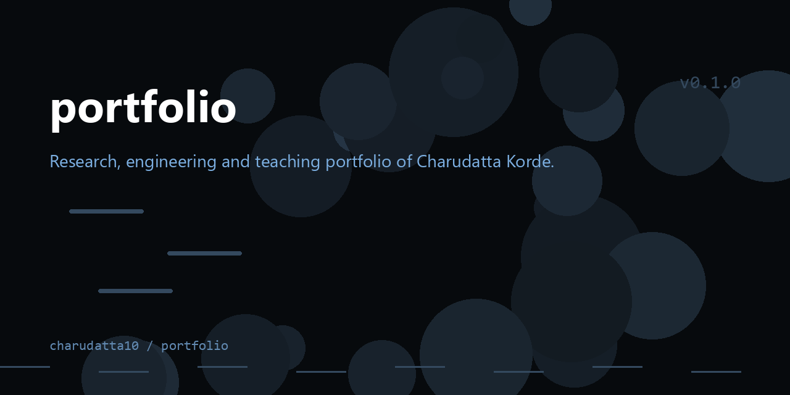

# Charudatta Korde — Portfolio

<p align="center">
  
</p>


Research, engineering and teaching portfolio of [Charudatta Korde](https://github.com/charudatta10)
— resource-efficient AI, FPGA acceleration, cybersecurity and open-source
software.

**Live:** https://charudatta10.github.io/portfolio/


## Highlights

- **Research** — hardware-optimised GAN architectures for FPGA-based edge
  devices; all nine publications verified against ORCID and Crossref on
  `pages/work.html`.
- **Projects** — every card links to its exact repository or live site, no
  generic "view profile" links.
- **Design** — hand-crafted SVG/CSS diagrams, dark/light themes, scroll
  reveals, responsive, accessibility-friendly.

## Structure

```
.
├── index.html                  # Homepage
├── pages/
│   ├── header.html             # Shared header (injected at runtime)
│   ├── footer.html             # Shared footer (injected at runtime)
│   ├── work.html               # Research areas, 9 publications, projects
│   ├── about.html              # Mission, education, experience, skills
│   ├── writing.html            # Articles, knowledge systems, docs
│   ├── now.html                # Current focus
│   ├── contact.html            # Channels + collaboration
│   └── gallery.html            # Research visualizations (inline SVG)
├── assets/
│   ├── css/style.css           # Design system
│   ├── js/main.js              # Theme, nav, reveal, animation
│   ├── include.js              # Header/footer loader + search boot
│   ├── images/svg/favicon.svg
│   └── CharudattaKorde.pdf     # CV
├── pagefind/                   # Pagefind search index (committed)
├── sitemap.xml
├── robots.txt
└── .github/workflows/pages.yml # Deploys the repo root to GitHub Pages
```

## Development

Serve locally:

```sh
python -m http.server 8000
```

Search uses [Pagefind](https://pagefind.app). After changing page content,
rebuild the index and commit it:

```sh
npx pagefind --site .
```

## Deployment

Pushing to `main` triggers the `pages.yml` workflow, which publishes the repo
root to GitHub Pages.

## License

The site content and design are © Charudatta Korde. Third-party trademarks
(IEEE, AMD Kintex, etc.) belong to their respective owners.