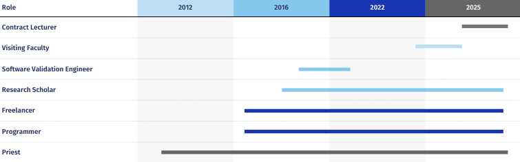

---

title: "Experience"
date: 2024-05-21
author: Charudatta G. Korde
tags: 
    - profile
    - work
glightbox: false

---

**🌟 Charudatta G. Korde: Multifaceted Professional Journey**

---

### **📘 Academic and Teaching Roles**

- **Contract Lecturer** *(2024 – Present)*:  
  - National Forensics Sciences University.  
  - Teaches **Incident Response** and **Vulnerability Assessment**, leveraging expertise in cybersecurity.

- **Visiting Faculty** *(2024)*:  
  - Goa Polytechnic College.  
  - Conducted practical sessions in **Basic Electronics**, sharing in-depth technical knowledge.

---

### **💻 Research and Industry Experience**

- **Research Scholar** *(2018 – Present)*:  
  - **NIT Goa**:  
    - Focus on **FPGA**, **AI**, **ML**, **Deep Learning**, and **GANs**.  
    - Served as a teaching assistant, strengthening academic and research skills.

- **Software Validation Engineer** *(2019)*:  
  - **Intel**:  
    - Validated tool flows using **Quartus software (v19.2 – v20.1)**.  
    - Gained expertise in software tools and validation processes.

---

### **👨‍💻 Freelancing and Open-Source Contributions**

- **Freelancer** *(2015 – Present)*:  
  - Projects include **MATLAB-based medical sleep data analysis** and **YouTube data analysis**.  
  - Skills honed: **Data Analysis**, **Programming**, and **Project Management**.

- **Open-Source Contributor** *(GitHub)*:  
  - Developed utilities like:
    - **Readme Generator**.  
    - **File Organization Tool**.  
    - **SVG Image Generator**.  

---

### **🙏 Religious Services**

- **Priest** *(2011 – Present)*:  
  - Performs traditional ceremonies such as **Ganesh Chaturthi Puja** and **Laxmi Puja**, showcasing the ability to balance technical and cultural responsibilities.

---

### **🔍 Focus Areas**

- **Core Competencies**:  
  - Cybersecurity, AI, FPGA, and Data Analysis.  
  - Expertise in teaching, research, and industry applications.
